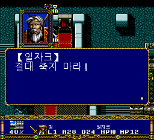

# PCE-Langrisser-Kr

*프리징, 그래픽 깨짐 이슈가 있을수 있습니다. 꼭 제보주세요

PC Engine CD-ROM²판 《랑그릿사: 광휘의 후예》 한국어 패치입니다.
현재 공개 버전은 **v0.703 · 원래 38트랙 구성의 실기 시험판**입니다.
추가 39번 트랙을 없애고 글꼴·공급 모듈을 기존 데이터 트랙으로 옮겼습니다.
**v0.702도 실기에서 같은 증상이 보고됐으며, v0.703의 실기 해결 여부는 아직 미확인입니다.**
실제 게임 화면을 바탕으로 만든 작업 기록과 테스트용 BPS 패치를 제공합니다.
원본 게임 이미지와 BIOS는 배포하지 않습니다.

> 미완성 검수판입니다. 번역 데이터가 들어 있다고 해서 일반·초 랑그
> 1~20화를 모두 자연 플레이로 클리어해 검증했다는 뜻은 아닙니다.

## 다운로드와 적용

[v0.703 릴리스에서 Windows 원클릭 패처 EXE 또는 수동 BPS ZIP 다운로드](https://github.com/OldManCraveGuitars-bit/PCE-Langrisser-Kr/releases/tag/v0.703)

Windows에서는 `PCE-Langrisser-Kr-v0.703-Patcher.exe`를 실행해 본인 소유의
일본 원본 ISO를 선택하면 됩니다. EXE가 원본 해시를 확인하고 단일 BIN·CUE를
한 폴더에 생성한 뒤 결과도 검증합니다. **게임 이미지와 BIOS는 EXE에 없습니다.**
원본은 수정하지 않고, 기존 파일은 덮어쓰지 않습니다. 결과용으로 약 560 MB의
여유 공간이 필요합니다. [패처 상세 안내와 소스](patcher/README.md)를 참고하세요.

수동으로 적용하려면 v0.703 BPS ZIP을 사용하세요:

1. 본인이 보유한 지원 일본 원본 ISO를 준비합니다. ISO의 SHA-256은
   `ECE10A51AABD107E7F4B83DACA1DEC7B3B0B43D7C15FCFBAE89E840C77910E68`입니다.
2. 릴리스 ZIP을 풀고, Floating IPS 등 BPS 적용 도구로 동봉된 `.bps`를
   원본 ISO에 적용합니다.
3. 결과 파일 이름을 `LANGRISSER_KR_TRACK2_COMPLETE_RELOCATION_V372.bin`으로 지정합니다.
4. 이 BIN과 동봉된 `.cue`를 같은 폴더에 둡니다. 추가 39번 트랙 자체가 없는 38트랙 구성입니다.
5. 실행 장비에서 **BIN이 아닌 CUE**를 엽니다. PC Engine CD-ROM² BIOS는 별도 준비가 필요합니다.

패치 적용 결과 BIN의 SHA-256은
`21ABC1F4E557665C127A646408E4748B7D28EB84C99964EE224E42984E49A7A6`입니다.
이전 버전의 세이브스테이트 자동 불러오기를 끄고 새로 부팅하세요.
게임 내부 메모리 저장은 별개이지만 미리 백업하는 것을 권합니다.
서로 다른 빌드의 BIN·CUE·추가 트랙을 섞지 마세요.

## 화면

아래 이미지는 에뮬레이터에서 저장한 원본 크기 화면이며, 별도 합성이나
가독성 보정은 하지 않았습니다. 메인 화면과 나머지 V368 캡처는 V369에서
해당 그림 데이터를 바꾸지 않은 구간입니다. 엔딩 B 이미지는 V369 캡처입니다.
아래 v0.703 진입 확인 화면은 V372를 새로 부팅해서 촬영했습니다.

에뮬레이터 확인 화면이며, 실기 정상 동작을 입증하는 사진은 아닙니다.

| 일반 1화 대사 | 지휘관 배치 |
| --- | --- |
|  |  |

| 일반 2화 대사 | 오프닝 영상 자막 |
| --- | --- |
|  |  |

영상보기 엔딩 B에서 깨졌던 후일담 본문을 수정한 뒤 촬영한 첫 화면:

## v0.7에서 확인한 작업

- 타이틀과 게임 내 메뉴·시나리오 대사·이름 표기를 한국어판으로 구성했습니다.
  한글화 크레딧에는 **기타 깎는 노인**을 표기했습니다.
- 오프닝과 여러 중간 영상에 게임 내부 한국어 자막을 넣었습니다. 자막은
  별도의 PC 화면 덮개가 아니라 게임 데이터 안에서 표시됩니다.
- 오프닝, 영상보기 1번, 15번의 그림 간섭을 수정했습니다. V368 검사에서는
  각 구간의 출력 프레임 5,488장·5,336장·1,987장을 일본 원판과 대조해
  그림 영역의 픽셀과 순서가 일치함을 확인했습니다.
- 영상보기 엔딩 B에서 후일담 본문이 모자이크처럼 깨지는 경로를 수정했습니다.
  B 선택 시 한글 글꼴을 먼저 읽고 원래 음원 선택을 이어 주며, 깨졌던 첫
  후일담 화면이 정상으로 표시됨을 확인했습니다.
- 일반 시나리오 1→2, 2→3, 3→4화의 종료 처리·게임 내부 저장·다음 화
  진입을 단축 조건으로 확인했습니다. 자연 전투를 전부 진행한 결과는 아닙니다.
- BPS 적용 후 결과 BIN이 V369 제품과 바이트 단위로 같은지 재적용 검증했고,
  디스크 MODE1 섹터 5,304개를 확인했습니다.

v0.701에서는 게임 본편 BIN과 BPS는 그대로 두고, 별도 39번 데이터 트랙을
`MODE1/2048`에서 EDC/ECC가 있는 `MODE1/2352`로 바꿨습니다. 일부 실기
장비의 2048바이트 데이터 트랙 처리 문제를 시험하기 위한 변경입니다.
에뮬레이터 단축 경로에서는 v0.7과 출력 상태가 같았지만, **Turbo EverDrive Pro
실기에서 같은 깨짐과 리셋이 재현됐습니다.**
자세한 내용은 [v0.701 릴리스 노트](RELEASE_NOTES-v0.701.md)를 참고하세요.
기존 변경 내역은 [v0.7 릴리스 노트](RELEASE_NOTES-v0.7.md)에 있습니다.

**v0.701과 v0.702 모두 실기에서 같은 증상이 보고됐습니다.** v0.702는
39번 트랙을 단일 BIN에 합치는 시험이었습니다. [v0.702 릴리스 노트](RELEASE_NOTES-v0.702.md).

v0.703은 추가 39번 트랙을 없애고 해당 23섹터의 데이터를 원래 2번 트랙의
빈 공간으로 옮겼습니다. 압축 글꼴을 포함한 읽기 주소 54곳을 이전했고,
원래 38트랙의 시간 배치·음악 데이터는 유지했습니다.
에뮬레이터 새 부팅에서 메뉴와 1화 지도·일자크 대사 표시를 확인했습니다.
60,000회 갱신 동안 BIOS 초기화 진입 기록은 없었지만, 실기 정상 동작이나
전체 시나리오 클리어를 보증하지 않습니다. [v0.703 릴리스 노트](RELEASE_NOTES-v0.703.md).

## 아직 남은 문제와 검증 범위

- [Turbo EverDrive Pro 실기에서 1화 진입 전 글자/화면이 깨지고 리셋된다는 보고](https://github.com/OldManCraveGuitars-bit/PCE-Langrisser-Kr/issues/2)가 있습니다. v0.701과 v0.702에서도 같은 증상이 보고됐습니다. v0.703의 해결 여부는 미확인입니다.
- 일반 1화 하단 직업/이름 줄에 금색 타일이 섞이는 그래픽 오류가 남아 있습니다.
- 영상보기 엔딩 B의 **첫** 후일담 화면은 확인했지만 알베르트 등 모든
  후일담 화면을 직접 캡처해 육안 검수한 것은 아닙니다.
- 일반·초 랑그 1~20화 전체 자연 플레이와 모든 영상·효과음·선택지의
  최신판 전수 검사는 끝나지 않았습니다. 특정 에뮬레이터의 모든 설정을
  보증하지도 않습니다.
- 이전 버전의 세이브스테이트를 최신 빌드에 그대로 불러오는 사용법은 검증하지
  않았습니다. 오류가 보이면 새 부팅 상태에서 재현 화면과 직전 조작을 남겨 주세요.

이 저장소의 스크린샷은 게임의 실제 실행 화면입니다.
[캡처 출처와 빌드 번호](screenshots/README.md)를 기록해 두었습니다.
원작 게임과 자료의 권리는 각 권리자에게 있습니다. 이 저장소에는 원본 게임
이미지·BIOS·사용자 저장 데이터가 없습니다.
