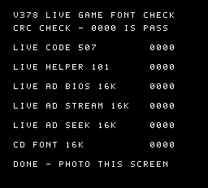
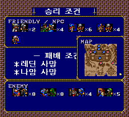

# PCE-Langrisser-Kr

*프리징, 그래픽 깨짐 이슈가 있을수 있습니다. 꼭 제보주세요

PC Engine CD-ROM²판 《랑그릿사: 광휘의 후예》 한국어 패치입니다.
현재 최신 공개판은 **v0.707 · 실제 게임 첫 한글 표시 시점 진단판**입니다.
**오프닝·타이틀을 거친 뒤 첫 한글 직전에 검사 화면으로 멈춥니다. 게임 진행용이 아닙니다.**
v0.706에서도 같은 실기 글자 깨짐·리셋이 보고됐습니다. 해결판으로 주장하지 않으며,
기존 한국어판·저장 파일은 보존해 주세요.
원본 게임 이미지와 BIOS는 배포하지 않습니다.

> 미완성 검수판입니다. 일반·초 랑그 1~20화를 모두 자연 플레이로 클리어한
> 결과나 실기 정상 동작을 보증하지 않습니다.

## v0.707 다운로드와 적용

[v0.707 릴리스 — Windows 패처 EXE / 수동 BPS ZIP](https://github.com/OldManCraveGuitars-bit/PCE-Langrisser-Kr/releases/tag/v0.707)

1. `PCE-Langrisser-Kr-v0.707-Patcher.exe`를 실행하고 본인 소유의 지원 일본 원본
   ISO를 선택합니다. 이전 패치판에 덧씌우지 마세요.
2. 별도 결과 폴더에 BIN·CUE를 만듭니다. 약 560 MB의 여유 공간이 필요합니다.
   원본은 수정하지 않고 기존 결과 파일도 덮어쓰지 않습니다.
3. `LANGRISSER_LIVE_FONT_DIAGNOSTIC_V378.bin`과 같은 이름의 `.cue`를
   같은 폴더에 두고 **CUE로 실행**하세요. 내부 버전명 V378은 정상입니다.
4. 이전 세이브스테이트 자동 불러오기를 끄고 새로 부팅한 뒤,
   **오프닝을 넘기고 타이틀에서 RUN**을 누릅니다.
5. `V378 LIVE GAME FONT CHECK` 제목과 `DONE - PHOTO THIS SCREEN` 또는
   멈춘 화면 전체를 촬영해 주세요. 검사 뒤 게임으로 진행되지 않는 것이 정상입니다.
   기존처럼 깨지거나 BIOS로 돌아가면 그 상태를 알려 주세요.

수동 BPS ZIP은 Floating IPS 등으로 일본 원본 ISO에 적용합니다.
결과 파일명을 위 BIN 이름으로 지정하고 동봉된 CUE와 함께 실행하세요.
원래 38트랙 구성이며 추가 39번 트랙은 없습니다.
[패처 소스와 상세 사용법](patcher/README.md).

지원 원본 SHA-256:

```text
ECE10A51AABD107E7F4B83DACA1DEC7B3B0B43D7C15FCFBAE89E840C77910E68
```

v0.707 결과 BIN SHA-256:

```text
D70F2F204FA1B43828CEF22AF9F6CB233B1451BB2EA3942968697A4E6868DEA6
```

## v0.707 검사 범위

v0.705는 별도로 만든 2KB 패턴을 검사했습니다. v0.707은 **실제 게임이
부팅·설치·전송한 16KB 글꼴과 실행 코드**를 첫 한글 표시 시점에서 검사합니다.
검사 직전에 글꼴이나 보조 코드를 재설치하지 않습니다.



| 항목 | 확인 대상 |
| --- | --- |
| LIVE CODE 507 | 실제 적재 모듈, 자기수정 피연산자 1바이트 제외 |
| LIVE HELPER 101 | 실제 설치된 글꼴 읽기 보조 코드 |
| LIVE AD BIOS 16K | 게임이 올린 글꼴을 BIOS로 읽기 |
| LIVE AD STREAM 16K | 같은 글꼴을 게임 코드로 연속 읽기 |
| LIVE AD SEEK 16K | 같은 글꼴을 매 주소 지정해 읽기 |
| CD FONT 16K | 비교용 CD 글꼴 데이터를 일반 RAM으로 읽기 |

`0000`은 해당 CRC 검사 통과이며 오류 개수가 아닙니다. 에뮬레이터에서
정상 데이터 6항목 통과와 고의 손상 데이터의 예상 오류 검출을 확인했습니다.
실기 해결은 미확인입니다. 추가 CD 읽기·화면 변경이 있는 진단이며,
모두 통과해도 게임 정상 동작을 보증하지 않습니다.
[상세 변경·검증·제한](RELEASE_NOTES-v0.707.md).

## 직전 v0.706의 에뮬레이터 확인 — 실기에서는 동일 실패 보고

v0.704 대비 **압축 글꼴 전송 설정 1바이트**를 바꿨습니다.
리셋 후 쓰기 주소가 0이라고 가정하는 대신, BIOS에 목적지 `0000`을
명시적으로 설정하게 합니다. 해당 섹터 EDC/ECC도 갱신했습니다.
번역·글꼴 그림·영상·음원·시나리오 진행 로직은 변경하지 않았습니다.

에뮬레이터 새 부팅에서 1화 조건 화면과 지도·한국어 대사를 확인했습니다.

| 1화 조건 화면 | 1화 지도·제시카 대사 |
| --- | --- |
|  |  |

실제 게임 실행 중 16KB 글꼴 전송 4회가 모두 주소 `0000~3FFF`에 원본과
같은 바이트로 기록됐습니다. 다른 데이터 전송 뒤 글꼴 재로딩도 포함합니다.
60,000회 갱신 동안 BIOS 초기화 재진입은 관측되지 않았습니다.
실기 성공이나 전체 캠페인 클리어의 증거는 아닙니다.
검사 기록과 제한은 [v0.706 릴리스 노트](RELEASE_NOTES-v0.706.md)에 있습니다.

## v0.705 실기 진단 결과

[이슈 6의 실기 사진](https://github.com/OldManCraveGuitars-bit/PCE-Langrisser-Kr/issues/6)에서
6개 항목 모두 `0000`, 완료 문구를 확인했습니다.
다만 2KB·인터럽트 비활성 독립 검사이고, 실제 게임과 전송 크기·목적지 설정이
다릅니다. 256바이트 반복 패턴이라 일부 상위 주소 오류도 검출하지 못합니다.
따라서 게임 경로까지 정상이라고 결론 내리지 않았습니다.

[v0.705 진단 전용 릴리스](https://github.com/OldManCraveGuitars-bit/PCE-Langrisser-Kr/releases/tag/v0.705)는
보존합니다. v0.705는 게임을 실행하지 않습니다.
v0.701~v0.704에서는 해당 실기 구성의 같은 실패가 보고됐으며,
v0.706에서도 동일한 실기 실패가 보고됐습니다.

## 이전 게임용 빌드 화면

아래 이미지는 에뮬레이터에서 저장한 원본 크기 화면이며, 별도 합성이나
가독성 보정은 하지 않았습니다. 메인 화면과 나머지 V368 캡처는 V369에서
해당 그림 데이터를 바꾸지 않은 구간입니다. 엔딩 B 이미지는 V369 캡처입니다.
아래 v0.704 진입 확인 화면은 V373을 새로 부팅해서 촬영했습니다.


에뮬레이터 확인 화면이며, 실기 정상 동작을 입증하는 사진은 아닙니다.

| 일반 1화 대사 | 지휘관 배치 |
| --- | --- |
|  |  |

| 일반 2화 대사 | 오프닝 영상 자막 |
| --- | --- |
|  |  |

영상보기 엔딩 B에서 깨졌던 후일담 본문을 수정한 뒤 촬영한 첫 화면:


## v0.7에서 확인한 작업

- 타이틀과 게임 내 메뉴·시나리오 대사·이름 표기를 한국어판으로 구성했습니다.
  한글화 크레딧에는 **기타 깎는 노인**을 표기했습니다.
- 오프닝과 여러 중간 영상에 게임 내부 한국어 자막을 넣었습니다. 자막은
  별도의 PC 화면 덮개가 아니라 게임 데이터 안에서 표시됩니다.
- 오프닝, 영상보기 1번, 15번의 그림 간섭을 수정했습니다. V368 검사에서는
  각 구간의 출력 프레임 5,488장·5,336장·1,987장을 일본 원판과 대조해
  그림 영역의 픽셀과 순서가 일치함을 확인했습니다.
- 영상보기 엔딩 B에서 후일담 본문이 모자이크처럼 깨지는 경로를 수정했습니다.
  B 선택 시 한글 글꼴을 먼저 읽고 원래 음원 선택을 이어 주며, 깨졌던 첫
  후일담 화면이 정상으로 표시됨을 확인했습니다.
- 일반 시나리오 1→2, 2→3, 3→4화의 종료 처리·게임 내부 저장·다음 화
  진입을 단축 조건으로 확인했습니다. 자연 전투를 전부 진행한 결과는 아닙니다.
- BPS 적용 후 결과 BIN이 V369 제품과 바이트 단위로 같은지 재적용 검증했고,
  디스크 MODE1 섹터 5,304개를 확인했습니다.

v0.701에서는 게임 본편 BIN과 BPS는 그대로 두고, 별도 39번 데이터 트랙을
`MODE1/2048`에서 EDC/ECC가 있는 `MODE1/2352`로 바꿨습니다. 일부 실기
장비의 2048바이트 데이터 트랙 처리 문제를 시험하기 위한 변경입니다.
에뮬레이터 단축 경로에서는 v0.7과 출력 상태가 같았지만, **Turbo EverDrive Pro
실기에서 같은 깨짐과 리셋이 재현됐습니다.**
자세한 내용은 [v0.701 릴리스 노트](RELEASE_NOTES-v0.701.md)를 참고하세요.
기존 변경 내역은 [v0.7 릴리스 노트](RELEASE_NOTES-v0.7.md)에 있습니다.

**v0.701과 v0.702 모두 실기에서 같은 증상이 보고됐습니다.** v0.702는
39번 트랙을 단일 BIN에 합치는 시험이었습니다. [v0.702 릴리스 노트](RELEASE_NOTES-v0.702.md).

v0.703은 추가 39번 트랙을 없애고 해당 23섹터의 데이터를 원래 2번 트랙의
빈 공간으로 옮겼습니다. 압축 글꼴을 포함한 읽기 주소 54곳을 이전했고,
원래 38트랙의 시간 배치·음악 데이터는 유지했습니다.
에뮬레이터 새 부팅에서 메뉴와 1화 지도·일자크 대사 표시를 확인했습니다.
60,000회 갱신 동안 BIOS 초기화 진입 기록은 없었지만, 실기 정상 동작이나
전체 시나리오 클리어를 보증하지 않습니다. **이후 실기에서 같은 증상이 보고됐습니다.**
[v0.703 릴리스 노트](RELEASE_NOTES-v0.703.md).

v0.704는 더미 읽기와 대기가 끝난 다음 ADPCM 제어 레지스터 `$180D`를
0으로 되돌리도록 기존 함수의 명령 순서를 바꾼 시험판입니다. 9바이트 함수 중
6바이트만 변경했으며, 해당 디스크 섹터의 EDC/ECC도 갱신했습니다.
에뮬레이터 새 부팅에서 메뉴와 1화 지도·테일러 대사 표시를 확인했습니다.
60,000회 갱신 동안 BIOS 초기화 진입 기록은 없었고, 초기 추적 구간의
주소 지정 12,758회에서 더미 읽기 완료 후 제어 신호 해제를 확인했습니다.
**실기 원인이나 해결을 확정한 결과는 아닙니다.**
검사 범위와 제한은 [v0.704 릴리스 노트](RELEASE_NOTES-v0.704.md)에 적었습니다.
**이후 v0.704도 실기에서 같은 증상이 보고됐습니다.**

v0.705는 원인 분리를 위한 독립 검사 화면입니다. 한글화 게임 로직을 추가로
수정한 버전이 아니며, 기존 게임·저장 파일과 공개 릴리스는 보존합니다.

## 아직 남은 문제와 검증 범위

- [Turbo EverDrive Pro 실기에서 1화 진입 전 글자/화면이 깨지고 리셋된다는 보고](https://github.com/OldManCraveGuitars-bit/PCE-Langrisser-Kr/issues/2)가 있습니다. v0.701·v0.702·v0.703·v0.704에서도 같은 증상이 보고됐습니다. v0.705의 독립 진단은 통과했지만 게임 정상 동작을 증명하지 않습니다. v0.706은 목적지 초기화 시험판이며 실기 미검증입니다.
- 일반 1화 하단 직업/이름 줄에 금색 타일이 섞이는 그래픽 오류가 남아 있습니다.
- 영상보기 엔딩 B의 **첫** 후일담 화면은 확인했지만 알베르트 등 모든
  후일담 화면을 직접 캡처해 육안 검수한 것은 아닙니다.
- 일반·초 랑그 1~20화 전체 자연 플레이와 모든 영상·효과음·선택지의
  최신판 전수 검사는 끝나지 않았습니다. 특정 에뮬레이터의 모든 설정을
  보증하지도 않습니다.
- 이전 버전의 세이브스테이트를 최신 빌드에 그대로 불러오는 사용법은 검증하지
  않았습니다. 오류가 보이면 새 부팅 상태에서 재현 화면과 직전 조작을 남겨 주세요.

이 저장소의 게임 스크린샷은 실제 실행 화면이며, v0.705 이미지는 별도 진단 프로그램의 실행 화면입니다.
[캡처 출처와 빌드 번호](screenshots/README.md)를 기록해 두었습니다.
원작 게임과 자료의 권리는 각 권리자에게 있습니다. 이 저장소에는 원본 게임
이미지·BIOS·사용자 저장 데이터가 없습니다.
