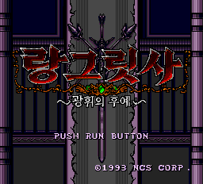
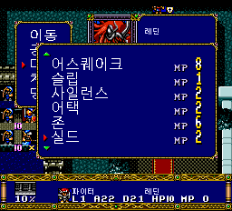
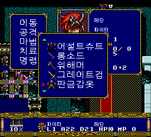
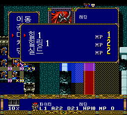
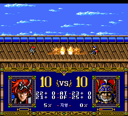

# v0.75 마법명 한글화와 페이지 넘김 화살표 수정

마법 사용 메뉴에 남아 있던 일본어 이름 19종을 한글 원음 표기로 바꾸고,
마법 목록 위·아래의 페이지 넘김 화살표가 한글 조각으로 보이던 문제를 수정했습니다.
실기 구동 성공이 보고된 v0.708의 글꼴 읽기 코드는 유지했습니다.
**v0.75 자체의 실기 재검증은 아직 진행되지 않았습니다.**

## 마법명 원음 표기

‘지진’ 같은 의역 대신 요청한 ‘어스퀘이크’ 방식으로 표기합니다.

| 구분 | 반영한 이름 |
| --- | --- |
| 공격 마법 | 매직 애로우, 라이트닝, 어스퀘이크, 선더, 파이어볼, 블리자드, 토네이도, 메테오, 블라스트 |
| 회복 마법 | 힐 1, 힐 2, 힐링 1, 힐링 2 |
| 보조 마법 | 슬립, 컨퓨즈, 사일런스, 실드, 어택, 존 |

원본의 16바이트 고정 길이 이름 표와 복제본에 같은 내용을 반영했습니다.
마법의 효과·소모 MP·습득 조건·캐릭터 능력치는 변경하지 않았습니다.
이름 표에 필요한 도트 7자를 추가·재배치했으며, 기존 번역에서 참조되지 않는
4칸과 비어 있던 3칸을 사용했습니다. 나머지 글꼴의 복원 결과는 그대로입니다.

## 페이지 넘김 화살표



위 화면의 ▲·▼는 일본 원판의 화살표 도트를 사용합니다.
필드의 작은 한글 글꼴을 화살표로 읽던 연결을 바꾸어,
열려 있는 창의 임시 글꼴 영역에 화살표 두 개를 따로 배치했습니다.
페이지 이동과 창 재진입 후에도 유지되는 것을 확인했습니다.

같은 전용 화살표 루틴을 사용하는 아이템 목록도 기존 표시 위치를 유지하도록
연결을 조정했습니다. 공용 필드 글꼴·테두리·아이콘을 덮어쓰지 않으며,
새 CD 읽기나 상주 RAM 영역은 추가하지 않았습니다.



## 마법 발동과 전투 확인





에뮬레이터의 게임 화면에서 다음 항목을 확인했습니다.

- 새 부팅 후 일반 1화 지도와 행동 메뉴 진입.
- 마법명 표시, 페이지 넘김, 마법창 닫기와 재진입.
- 페이지 이동 전후 공용 필드 글꼴의 VRAM 바이트 일치.
- 힐 발동: 시험 대상 HP 1→4, MP 99→98, 행동 종료 후 필드 복귀.
- 어스퀘이크 발동: 소모 MP 8과 행동 종료 후 필드 복귀.
- 일반 타격 전투의 화면 표시, HP·행동 상태 변화와 필드 복귀.
- 아이템 목록의 화살표 위치, 페이지 이동과 테두리 표시.

**마법·전투 화면은 재현 시간을 줄이기 위해 시험 실행의 RAM에서 직업·MP·HP·
위치를 조정한 검사입니다.** 아이템 목록은 시험 실행에서 기존 창 초기화 루틴을
호출한 검사입니다. 이러한 시험용 값과 호출 경로는 배포 이미지에 들어 있지 않습니다.
스크린샷은 실제 에뮬레이터 출력이며 자연 플레이로 해당 능력치에 도달했다는 뜻은 아닙니다.

19종 이름 표 전체와 필요한 글꼴의 복원을 정적 검사했습니다.
라이트닝을 포함한 모든 마법의 개별 발동, 일반·초 랑그 전 시나리오 자연 클리어,
모든 영상·모든 실기 구성까지 이번 버전에서 다시 검증한 것은 아닙니다.

## 유지한 부분

- v0.708에서 실기 구동 성공이 보고된 매 바이트 주소 지정 글꼴 읽기 방식.
- 시나리오 이벤트와 전투 진행 코드, 마법 비용·효과 표.
- 영상·음원·전투 효과음 데이터와 원래의 38트랙 구성.
- 기존 v0.708 릴리스 파일과 태그. 이전 패처는 교체하지 않았습니다.

이번 변경은 마법 이름·관련 글꼴과 마법/아이템 목록의 화살표 표시 부분에 한정됩니다.
검사한 화면 밖의 문제나 실기별 차이가 없다는 보증은 아닙니다.

## 다운로드와 적용

[v0.75 릴리스의 Windows 패처 EXE와 수동 BPS ZIP](https://github.com/OldManCraveGuitars-bit/PCE-Langrisser-Kr/releases/tag/v0.75)

1. 본인 소유의 지원 일본 원본 ISO에 적용합니다. 이전 한글판에 덧씌우지 마세요.
2. 생성된 `LANGRISSER_KR_MAGIC_PAGES_V382.bin`과 `.cue`를 같은 폴더에 두고
   **CUE로 실행**합니다. 내부 파일명 V382는 정상입니다.
3. 이전 세이브스테이트 자동 불러오기를 끄고 새로 부팅합니다.
   기존 게임 내 저장 파일은 먼저 백업해 주세요.

EXE에는 패치 차분과 CUE만 포함하며 게임 원본·BIOS는 포함하지 않습니다.
원본 크기·SHA-256·BPS CRC를 검사하고 기존 출력은 덮어쓰지 않습니다.
패처의 실제 적용 결과가 검수한 BIN과 일치하는지, 잘못된 입력과 기존 출력이
안전하게 거부되는지도 검사했습니다. 출력용으로 약 560 MB가 필요합니다.

지원 일본 원본 SHA-256:

```text
ECE10A51AABD107E7F4B83DACA1DEC7B3B0B43D7C15FCFBAE89E840C77910E68
```

v0.75 결과 BIN SHA-256:

```text
9931CF9871AE835F5BA82BBF695FFC8D19A948EFAD0D794C76F2FECC9ECFB93E
```
