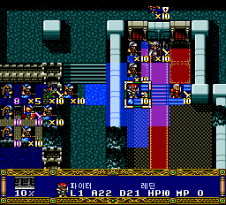
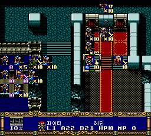
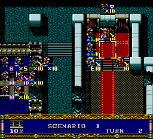
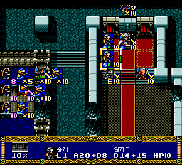
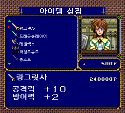
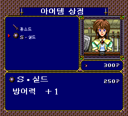

# v0.8 명령·마법 아이콘 복구와 상점 스크롤 개선

지휘관집중·수동을 선택하거나 어택·실드를 사용했을 때 필드 아이콘이
‘디’, ‘비’ 같은 한글 조각으로 나타나는 문제를 수정했습니다.
아이템이 많은 상점에서 구매·판매 목록을 위아래로 넘길 때 발생하던 지연도 줄였습니다.
v0.75의 마법명 원음 표기와 페이지 넘김 화살표 수정은 그대로 포함합니다.

**v0.8은 에뮬레이터의 해당 기능 검사를 마친 시험판입니다. 새 버전의 실기 확인과
드문 마법 연출의 아이콘 영역 충돌 검수는 남아 있습니다.**
실기 구동 성공이 보고된 버전은 v0.708이며, 그 결과를 v0.8의 실기 검증으로 간주하지 않습니다.

## 지휘관집중·수동 아이콘

한글 글꼴이 들어 있는 칸을 원래 아이콘으로 읽던 참조를 바꿨습니다.
일본 원판의 네 아이콘 도트를 별도 칸에 배치하고 해당 표시만 연결했습니다.
공용 한글 글꼴과 캐릭터 이름·클래스 표는 바꾸지 않았습니다.

| 지휘관집중 선택 후 | 수동 선택 후 |
| --- | --- |
|  |  |

두 명령은 게임의 실제 메뉴에서 선택했습니다. 명령값을 RAM에 직접 써 넣지 않았으며,
필드에 표시된 아이콘 도트가 일본 원판과 일치하는 것을 확인했습니다.

## 어택·실드 사용 후 아이콘

| 어택 사용 후 | 실드 사용 후 |
| --- | --- |
|  |  |

두 마법 모두 실제 마법 메뉴에서 대상 선택과 시전을 거쳤습니다.
검사에서는 MP가 99에서 97로 줄고 대상 부대에 원래 효과 상태가 적용됐습니다.
효과 아이콘이 일본 원판 도트로 표시되는 것까지 확인했으며,
마법의 효과 계산·소모 MP·습득 조건은 변경하지 않았습니다.

빠른 재현을 위해 시험 실행에서 직업과 MP를 조정했습니다. 위 아이콘 확인 화면에서는
원판도 효과 아이콘보다 우선 표시하는 NPC 표식만 잠시 숨겼습니다.
효과 상태를 강제로 만든 검사가 아니며, **이 시험용 설정은 배포 이미지에 들어 있지 않습니다.**

## 상점 구매·판매 목록 스크롤

상점에서 아이템 한 줄을 다시 그릴 때마다 한글 도트를 반복 전송하던 부분을 수정했습니다.
상점에서 필요한 글꼴을 재사용하고, 상점을 나갈 때는 재사용 상태를 해제합니다.
가격·재고·소지품 데이터와 아이템 이름은 변경하지 않았습니다.

| 많은 아이템 표시와 상점 재진입 | 구매 완료 후 목록 |
| --- | --- |
|  |  |

동일한 15개 아이템과 입력 조건으로 목록 페이지 이동을 세 번씩 비교했습니다.
아래 수치는 **게임 내부 입력 갱신 횟수**이며 밀리초나 화면 프레임 수가 아닙니다.

| 검사 | 일본 원판 | v0.75 | 개선 후 |
| --- | --- | --- | --- |
| 구매 목록 | 9 / 9 / 9 | 79 / 80 / 80 | 9 / 10 / 10 |
| 판매 목록 | 9 / 9 / 8 | 80 / 80 / 79 | 10 / 10 / 9 |

이 조건에서 스크롤 지연은 일본 원판에 가까워졌습니다.
측정은 상점 수정 단독 빌드 V383에서 수행했고, 이를 포함한 최종 V384에서는 구매 완료도
확인했습니다. V383에서는 판매 완료와 상점 재진입을 별도로 확인했습니다.
실기의 체감 속도나 모든 목록 길이에 대한 수치는 아닙니다.

## 수정 범위와 검증 한계

- 최종 배포 빌드는 **V384**입니다. 지휘관집중·수동, 어택·실드의 실제 처리와
  아이콘 표시, 구매 완료, 일반 타격 전투 후 필드 복귀를 확인했습니다.
- 네 아이콘은 기존 필드 그림의 투명한 128바이트 영역을 사용합니다.
  보관된 필드 상태 7,239개에서는 이 영역을 사용하는 스프라이트가 없었습니다.
  다만 과거 상태에 화면 밖 타일 참조가 있어, 모든 스프라이트 정의와 드문 마법 연출에서의
  충돌 여부까지 입증한 것은 아닙니다. **다른 효과 사용 후 깨짐이 보이면 제보해 주세요.**
- v0.708의 매 바이트 주소 지정 글꼴 읽기 방식을 유지했습니다.
  새 CD·ADPCM 읽기나 VRAM 전송 코드는 추가하지 않았습니다.
- 시나리오 이벤트, 마법 계산, 영상·음원 데이터, 에뮬레이터 코어는 변경하지 않았습니다.
  원래의 38트랙 구성이며 추가 39번 트랙은 없습니다.
- 스크린샷은 실제 에뮬레이터 출력입니다. 상점·전투는 재현용 아이템·위치 조건을
  조정한 약식 검사이며, 자연 플레이나 실기 촬영을 뜻하지 않습니다.
- 일반·초 랑그 1~20화 전체 자연 플레이, 모든 영상·마법, 모든 실기 구성의
  정상 동작을 이번 버전에서 보증하지 않습니다. 게임 내 저장 파일을 먼저 백업하세요.

## 다운로드와 적용

[v0.8 릴리스 — Windows 패처 EXE와 수동 BPS ZIP](https://github.com/OldManCraveGuitars-bit/PCE-Langrisser-Kr/releases/tag/v0.8)

1. `PCE-Langrisser-Kr-v0.8-Patcher.exe`를 실행하고 본인 소유의 지원 일본 원본 ISO를
   선택합니다. 이전 한글판에 덧씌우지 마세요.
2. 별도 결과 폴더에 생성된 `LANGRISSER_KR_FIELD_MARKERS_V384.bin`과 `.cue`를 함께 두고
   **CUE로 새로 부팅**합니다. 내부 이름 V384는 정상입니다.
3. 이전 세이브스테이트 자동 불러오기는 끄세요. 기존 게임 내 저장 파일은 백업하세요.
4. 수동 적용은 ZIP의 BPS를 일본 원본에 적용하고, 결과 BIN 이름을 위 이름으로 지정한 뒤
   동봉된 CUE와 함께 실행합니다.

출력용 여유 공간은 약 560 MB입니다. EXE에는 BPS 차분과 CUE만 포함하며 게임 원본·BIOS는
배포하지 않습니다. 패처는 원본 크기·SHA-256·BPS CRC와 결과 BIN·CUE를 검사하고,
원본이나 기존 결과를 덮어쓰지 않습니다.

지원 일본 원본 SHA-256:

```text
ECE10A51AABD107E7F4B83DACA1DEC7B3B0B43D7C15FCFBAE89E840C77910E68
```

v0.8 결과 BIN SHA-256:

```text
7EA3AE0884805E55BECC1E42C0B95FCBBE10D00CE6593C27FEAE77E9CCB12436
```

ZIP에는 이번 검사의 기록과 스크린샷을 함께 담았습니다. 빌드 직후 정적 보고서의
`runtime_verified: false`는 당시 상태이며, 이후 실행 결과는 `game-audit.json`을 참고하세요.
해당 실행 보고서도 공개 전 검사 기록이므로 게시 상태와는 별개입니다.
기존 v0.75 이하 릴리스 파일과 태그는 교체하지 않았습니다.
